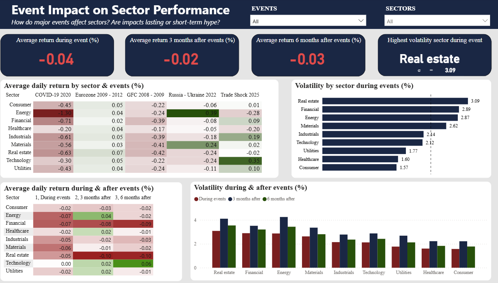

# Sector Performance Analysis: Event Impact & Long-Term Growth

## A data-driven guide for investors to navigate major market events without FOMO.

## Tools used: Google Finance (data source) · Microsoft Excel Power Query (consolidation) · MySQL (data modelling & analytical views) · Power BI (DAX, interactive dashboard)
---
### 1. Purpose of the Project:
Fear Of Missing Out (FOMO) is one of the most financially damaging behaviours in modern investing. When a geopolitical or economic event causes a sector to spike, retail investors often rush in, believing they are seizing an opportunity — only to buy at inflated prices and watch the gains evaporate.
This project tests that behaviour against 17 years of evidence. Using 47,000+ daily price records across 9 US sector ETFs (2008–2025), it answers a single core question:
> **How do major economic and geopolitical events impact different stock sectors — and do those impacts last, or are they short-term hype?**

The goal is to give investors an objective, repeatable framework to separate temporary, event-driven spikes from genuine, structurally-supported long-term growth — and to do so interactively for any past or future market event.

### 2. Key Insights: 
- Energy is the clearest FOMO trap. During the Russia–Ukraine shock, Energy posted the single highest event performance in the entire dataset (+0.39% avg daily return) — but this decayed to +0.17% within 6 months (a ~56% drop in momentum), while carrying the highest volatility. The spike reflects supply disruption, not structural demand.
- Technology is the consistent long-term outperformer. It dips during shocks then recovers above pre-event levels every time (e.g. COVID-19: −0.30% during → +0.32% at 6 months). Event dips are entry opportunities, not warning signals.
- Healthcare offers the best risk-adjusted growth. Moderate positive returns with the lowest volatility of any growth sector (σ ≈ 1.60% vs 2.87% for Energy), making it ideal during geopolitical uncertainty.
- Real Estate & Financials are the most structurally vulnerable. Highest event volatility (Real Estate GFC σ = 6.40) and the slowest recovery — Financials were still deteriorating 6 months after the GFC ended.
- Utilities & Consumer are defensive anchors. Low volatility and predictable, mild recovery — they protect capital during disruption rather than driving growth.

#### Event character matters more than the aggregate. For example, COVID-19 was an acute but recoverable shock (sharp drop, fast rebound), whereas the Global Financial Crisis caused lasting structural damage (slow, incomplete recovery). Sustainable returns come from structural drivers, not from temporary disruptions in sectors like Energy or Materials.

### 3. Dataset Description:
Source: Daily price data for 9 iShares US sector ETFs, sourced from Google Finance.

Coverage: 47,000+ daily records spanning 2008–2025 (17 years).

#### Sector ETs table
| Ticker | Sector | Full Name |
| :---: | :---: | :---: |
| IYW | Technology | iShares U.S. Technology ETF |
| IYH | Healthcare | iShares U.S. Healthcare ETF |
| IYF | Financials | iShares U.S. Financials ETF |
| IYE | Energy | iShares U.S. Energy ETF |
| IYK | Consumer | iShares U.S. Consumer Staples ETF |
| IYJ | Industrials | iShares U.S. Industrials ETF |
| IDU | Utilities | iShares U.S. Utilities ETF |
| IYM | Materials | iShares U.S. Materials ETF |
| IYR | Real Estate | iShares U.S. Real Estate ETF |

#### Market events table
| Event | Start | End | Nature of Shock
| :---: | :---: | :---: | :---: |
| Global Financial Crisis | Sep 2008 | Mar 2009 | Systemic financial collapse |
| Eurozone Sovereign Debt Crisis | Dec 2009 | Jul 2012 | Prolonged policy-managed crisis |
| COVID-19 Pandemic | Feb 2020 | Mar 2020 | Sudden demand destruction |
| Russia–Ukraine War (Initial Shock) | Feb 2022 | Feb 2022 | Geopolitical commodity shock |
| 2025 Spring Trade Shock | Apr 2025 | May 2025 | US trade policy disruption |

> Event dates represent the **peak period of market disruption** (estimated from public information), not the official political/economic start and end dates.

Preparation & modelling pipeline
- Collection — Individual CSVs downloaded per ETF ticker, each tagged with `Ticker` and `Sector` columns to enable cross-sector analysis.
- Consolidation — All 9 files merged into one master dataset (47,000+ rows) using Power Query in Excel.
- Quality checks — Verified for duplicates, correct data types, chronological/logical consistency (High ≥ Low), and consistent labels. First-day `Daily_return` nulls handled with `NULLIF` rather than dropped.
- Data modelling (MySQL) — Loaded into a `market_sector` database with a fact table (`stock_price_summary`) and an `event` reference table. Three analytical views segment performance into during event, 3 months after, and 6 months after windows.
- Dashboard model (Power BI) — The views imported via the MySQL connector. A calculated DAX table (`All_Phases`, built with `UNION` + `SELECTCOLUMNS`) combines the three phases for the trend matrix visuals.

### 4. Visualisation:

The interactive Event Impact Dashboard (Power BI) lets users explore any event/sector combination via slicers. It is designed to answer directly: are event impacts lasting, or short-term hype?

It contains:

- KPI cards — average daily return during the event, 3 months after, 6 months after, and the highest-volatility sector for the selected event.
- Average return heatmap — a sector × event matrix with red-white-green conditional formatting centred at zero.
- Volatility bar chart — standard deviation of daily returns by sector during events, with a baseline reference line.
- Return trend matrix — the three phases (During / 3M after / 6M after) as colour-coded columns.
- Volatility clustered column chart — compares volatility across the three phases per sector, confirming whether volatility normalises after the event.
  

### 5. Disclaimer:
This project is produced solely for informational purposes. It does not constitute financial advice, a solicitation, or a recommendation to buy or sell any financial instrument. Past performance is not indicative of future results. Investors should conduct their own due diligence and consult a qualified, regulated financial advisor before making any investment decisions.

For any queries, please reach out to phingochai2005@gmail.com
